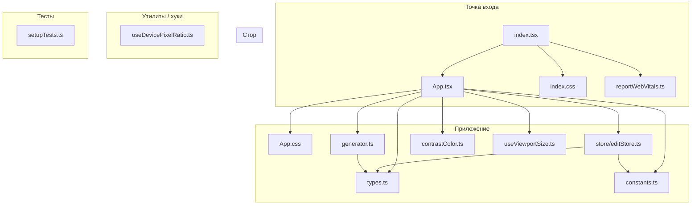
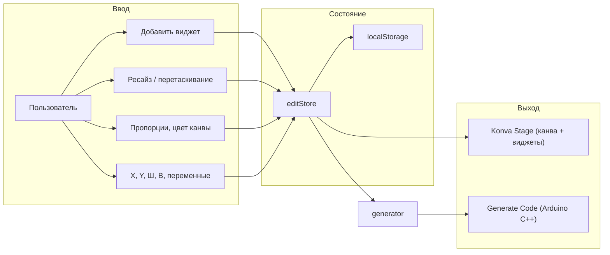

# Структура проекта Flprog WebUI Editor

Краткое описание файлов и их ролей в приложении. В конце — диаграмма зависимостей.

---

## Корень проекта

| Файл | Назначение |
|------|------------|
| **package.json** | Зависимости (React, Konva, Zustand, TypeScript), скрипты (`start`, `build`, `test`, `deploy`), настройки браузеров. |
| **README.md** | Описание репозитория и инструкции по запуску. |

---

## Папка `src/`

### Точка входа и приложение

| Файл | Назначение |
|------|------------|
| **index.tsx** | Точка входа: монтирует React-приложение в `#root`, подключает `index.css`, вызывает `reportWebVitals`. |
| **App.tsx** | Главный компонент: канва (Konva Stage), виджеты, левая панель (добавление виджетов), правая панель (Canvas, свойства выбранного виджета, генерация кода). Содержит логику масштаба, пропорций (ПК/планшет/мобильный), вкладок, перетаскивания и ресайза. |
| **App.css** | Стили layout: `.app-root`, боковые панели, `.canvas-container`, вкладки, мобильная вёрстка (breakpoint 768px), кнопки-переключатели панелей. |
| **index.css** | Глобальные стили (сброс, шрифты, `body`, `#root`). |

### Типы и константы

| Файл | Назначение |
|------|------------|
| **types.ts** | Интерфейсы: `Widget` (id, type, x, y, width, height, text, caption, color, varName, varType, tabId), `Tab` (id, name). |
| **constants.ts** | `GRID_SIZE` (шаг сетки), `PIXELS_PER_UNIT` (масштаб по умолчанию), функция `snapToGrid()`. |

### Состояние и хранилище

| Файл | Назначение |
|------|------------|
| **store/editStore.ts** | Zustand-стор: виджеты, выбранный id, буфер обмена, `canvasConfig` (width, height, color), вкладки, `activeTabId`. Все изменения синхронизируются с `localStorage`. Методы: добавление/обновление/удаление виджетов, копирование/вставка, порядок слоёв, вкладки. |

### Генерация кода и утилиты

| Файл | Назначение |
|------|------------|
| **generator.ts** | `generateArduinoCode(widgets, canvasConfig)` — формирует C++/Arduino-код: объявления переменных, JSON-конфиг виджетов, обработчики событий, `setup()` и `loop()`. |
| **contrastColor.ts** | `contrastColor(hexOrRgb)` — возвращает чёрный или белый для контраста на фоне; `getLuminance(hexOrRgb)` — относительная яркость (WCAG). Используется для цвета текста на виджетах и подписях. |
| **useViewportSize.ts** | Хук: текущие `width` и `height` окна (`window.innerWidth/innerHeight`), обновление при `resize`. |
| **useDevicePixelRatio.ts** | Хук: текущий `devicePixelRatio` (для возможного масштабирования под PPI). Сейчас в UI не используется. |

### Тесты и окружение

| Файл | Назначение |
|------|------------|
| **setupTests.ts** | Подключение `@testing-library/jest-dom` перед тестами. |
| **reportWebVitals.ts** | Опциональная отправка метрик (CLS, FID, FCP, LCP, TTFB) через `web-vitals`. |
| **react-app-env.d.ts** | Типы для Create React App (например, для `import` не-TS модулей). |

---

## Папка `docs/`

| Файл | Назначение |
|------|------------|
| **UI_RULES.md** | Правила UI: канва, пропорции, сетка, виджеты, копирование, генерация кода. |
| **UI_RENDER_RULES.md** | Правила отрисовки (если есть). |
| **PROJECT_STRUCTURE.md** | Этот документ — описание файлов и структуры проекта. |

---

## Диаграмма зависимостей (упрощённо)

---

## Поток данных (логика приложения)

---

## Зависимости ключевых модулей

- **App.tsx** использует: `react-konva` (Stage, Layer, Group, Line, Rect, Circle, Text, Transformer), `editStore`, `generator`, `contrastColor`, `useViewportSize`, `types`, `constants`.
- **editStore** хранит данные в формате из **types.ts** и при каждом изменении пишет в **localStorage**.
- **generator** читает виджеты и `canvasConfig` и выдаёт строку с кодом под Flprog/Arduino.

Если нужно расширить редактор (новый тип виджета, новый экспорт), точки входа: `types.ts` → `editStore` (дефолты при добавлении) → `App.tsx` (отрисовка и форма свойств) → `generator.ts` (код под новый тип).
